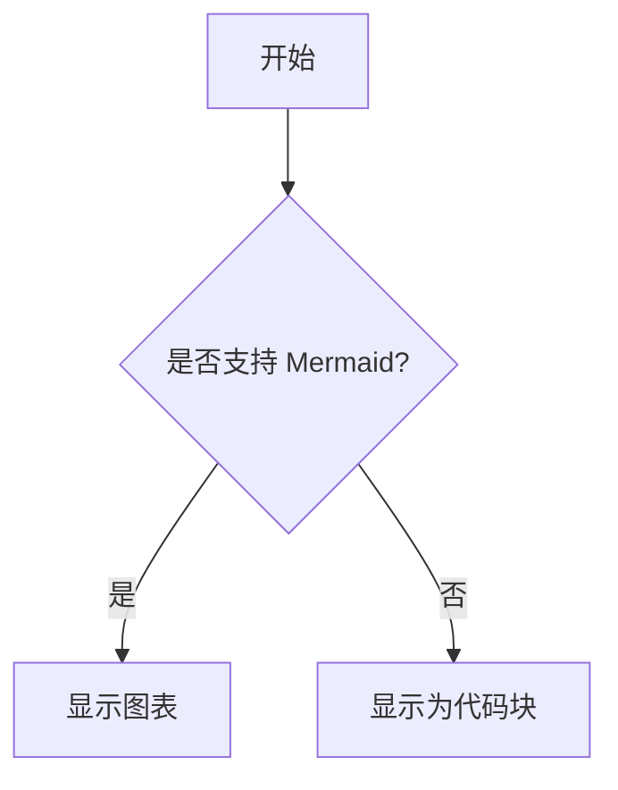

# Markdown 功能检测文件

## 1. 基本文本

**加粗文本**  
*斜体文本*  
~~删除线~~  
`行内代码`

## 2. 列表

### 无序列表
- 项目一
- 项目二
  - 子项目

### 有序列表
1. 第一项
2. 第二项

## 3. 引用

> 这是一个引用块  
> 支持多行

## 4. 代码块

```python
def hello():
    print("Hello, Markdown!")
```

## 5. 表格

| 名称 | 类型 | 是否支持 |
|------|------|----------|
| Markdown | 文本 | ✅ |
| Mermaid | 图表 | ❓ |
| LaTeX | 数学 | ❓ |

## 6. 链接与图片

[OpenAI 官网](https://www.openai.com)


## 7. Mermaid 测试



## 8. LaTeX 行内公式

这是一个行内公式：$E = mc^2$

## 9. LaTeX 块级公式

$$
\int_0^\infty e^{-x} dx = 1
$$

## 10. 任务列表

- [x] 基本 Markdown
- [ ] Mermaid
- [ ] LaTeX

---

**说明**：  
请在你的 Markdown 渲染环境中打开本文件，检查上述内容是否被正确渲染。
